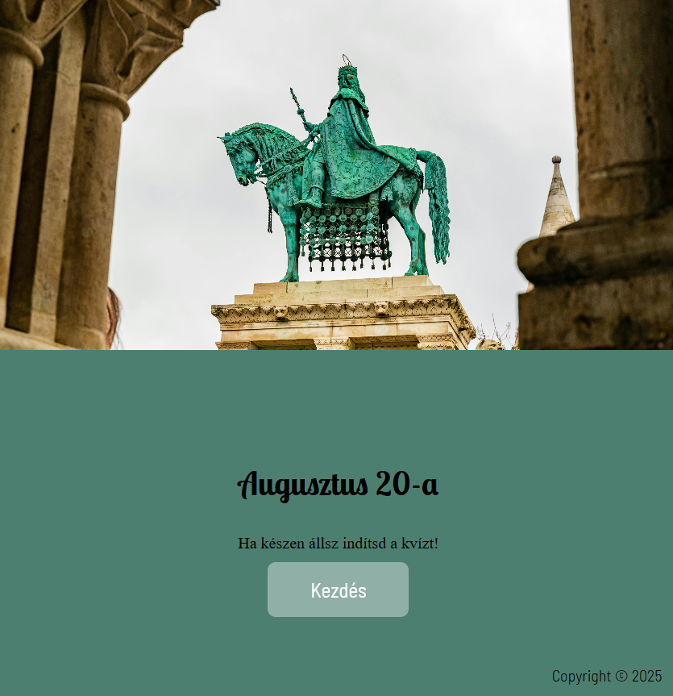

<p align="right">
  🌐 <a href="README_EN.md">English version</a>
</p>

# National Holiday QUIZ

**Nyelv:** HU Magyar | [GB English](README_EN.md)

## Képernyőképek


*Főoldal reszponzív megjelenése*


*Főoldal reszponzív megjelenése*


*Kvíz megjelenése*


*Kvíz vége megjelenése*

Egy Node.js alapú kvíz alkalmazás PostgreSQL adatbázissal.

# Funciók

- Random 10 kérdés augusztus 20-ával kapcsolatban.
- Radio inputokkal való válasz lehetőség
- Pontszám követése

## Telepítés és Futtatás

### 1. Klónozás

```bash
git clone <repo_url>
cd national_holiday_quiz
```

### 2. Függőségek telepítése

```bash
npm install
```

### 3. PostgreSQL adatbázis létrehozása és importálása

#### 1. Hozz létre egy új adatbázist: 

```bash
createdb national_holiday_quiz
```

#### 2. Importáld a dump fájlt (a projekt gyökerében national_holiday_quiz.sql):

```bash
psql -d national_holiday_quiz -f national_holiday_quiz.sql
```

### 4. Környezeti változók beállítása
- Hozz létre a projekt gyökerében egy .env fájlt a saját PostgreSQL hozzáféréseddel:
- DB_USER=postgres
- DB_HOST=localhost
- DB_NAME=national_holiday_quiz
- DB_PASS=your_password
- DB_PORT=5432


### 5. Futtatás

```bash
npm start 
# vagy 
nodemon
```

- A kvíz elérhető a böngészőben: http://localhost:3000


## Készítette

Név: Lukács Zita