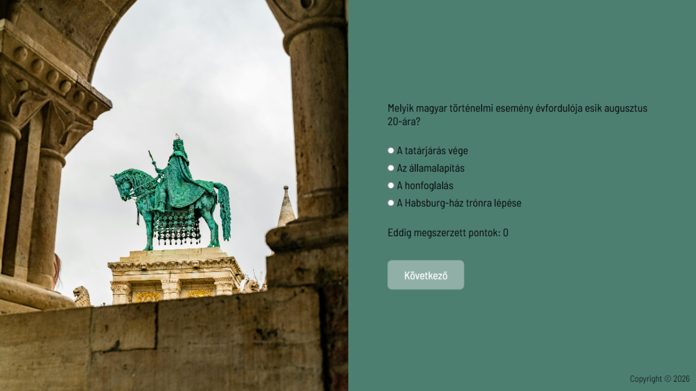

<p align="right">
  🌐 <a href="README.md">Magyar verzió</a>
</p>

# National Holiday QUIZ

**Language:** EN English | [HU Magyar](README.md)

## Screenshots

  

 

 

  

A Node.js–based quiz application with a PostgreSQL database.

# Features

- Random set of 10 questions related to August 20 (Hungary’s national holiday)
- Answering via radio inputs
- Score tracking

## Installation & Running

### 1. Clone the repository

```bash
git clone <repo_url>
cd national_holiday_quiz
```

### 2. Install dependencies

```bash
npm install
```

### 3. Create and import the PostgreSQL database

#### 1. Create a new database:

```bash
createdb national_holiday_quiz
```

#### 2. Import the SQL dump (located in the project root: national_holiday_quiz.sql):

```bash
psql -d national_holiday_quiz -f national_holiday_quiz.sql
```

### 4. Set up environment variables
- Create a .env file in the project root:
- DB_USER=postgres
- DB_HOST=localhost
- DB_NAME=national_holiday_quiz
- DB_PASS=your_password
- DB_PORT=5432


### 5. Run the application

```bash
npm start 
# or
nodemon
```

The quiz will be available at:
http://localhost:3001


## Created by

Name: Zita Lukács